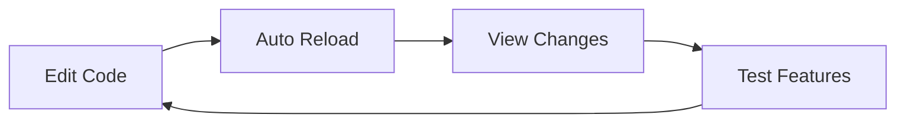

# 🚀 Quick Start Guide

## Baby Monitor Dashboard - Get Started in 5 Minutes

### Prerequisites

Before you begin, ensure you have:
- **Node.js** (v14 or higher) - [Download here](https://nodejs.org/)
- **npm** (comes with Node.js) or **yarn**
- A code editor (VS Code recommended)

### Step 1: Install Dependencies

Open your terminal in the project directory and run:

```bash
npm install
```

This will install all necessary packages including:
- React 18
- Tailwind CSS
- PostCSS & Autoprefixer

**Expected output:**
```
added 1500+ packages in 30s
```

### Step 2: Start Development Server

Run the development server:

```bash
npm start
```

**Expected output:**
```
Compiled successfully!

You can now view baby-monitor-dashboard in the browser.

  Local:            http://localhost:3000
  On Your Network:  http://192.168.x.x:3000
```

The app will automatically open in your browser at `http://localhost:3000`

### Step 3: Connect to Backend (Optional)

If you have a backend server running:

1. Ensure your backend WebSocket server is running on `ws://localhost:8000/ws`
2. The frontend will automatically attempt to connect
3. Check the browser console for connection status

**Connection logs:**
```javascript
WebSocket connected        // ✅ Success
WebSocket disconnected     // ⚠️ No backend found
Reconnecting... Attempt 1  // 🔄 Retry in progress
```

### Step 4: Explore the Dashboard

#### 📊 Dashboard Page (Default)
- View live camera feed
- Monitor baby detection status
- Check daily summaries
- Review recent alerts and activity

#### 🚨 Alerts Page
- View alert history
- Clear alerts
- Monitor severity levels

#### ⚙️ Settings Page
- Configure camera URL
- Adjust alert cooldown
- Enable/disable detection features
- Start/stop monitoring

### Features at a Glance

| Feature | Description | Status |
|---------|-------------|--------|
| 👶 Baby Detection | Real-time baby monitoring | ✅ Ready |
| 👤 Adult Detection | Adult presence tracking | ✅ Ready |
| 😢 Cry Detection | Crying alert system | ✅ Ready |
| 📹 Live Feed | Camera stream display | ✅ Ready |
| 🔔 Alerts | Real-time notifications | ✅ Ready |
| 📊 Analytics | Daily summaries | ✅ Ready |
| ⚙️ Settings | Customizable config | ✅ Ready |

### Common Commands

```bash
# Start development server
npm start

# Build for production
npm build

# Run tests
npm test

# Eject configuration (⚠️ irreversible)
npm run eject
```

### Project Structure Quick Reference

```
src/
├── components/          # Reusable UI components
│   ├── common/         # StatusCard, AlertCard, etc.
│   └── layout/         # NavSidebar
├── pages/              # Dashboard, Alerts, Settings
├── services/           # WebSocketService
├── styles/             # CSS and animations
└── App.jsx            # Main application
```

### Customization Tips

#### 1. Change WebSocket URL

Edit `src/services/WebSocketService.js`:

```javascript
connect(url = 'ws://YOUR_SERVER:PORT/ws') {
  // ...
}
```

#### 2. Modify Colors

Edit `tailwind.config.js` or `src/styles/animations.css`

#### 3. Add New Pages

1. Create new file in `src/pages/`
2. Import in `src/App.jsx`
3. Add route in `renderCurrentPage()`

#### 4. Create New Components

1. Create file in `src/components/common/`
2. Export from `src/components/index.js`
3. Import where needed

### Troubleshooting

#### Issue: Port 3000 already in use

**Solution:**
```bash
# Kill process on port 3000 (Windows)
netstat -ano | findstr :3000
taskkill /PID <PID> /F

# Or use different port
PORT=3001 npm start
```

#### Issue: WebSocket connection fails

**Solution:**
- Check backend server is running
- Verify WebSocket URL in browser console
- Check firewall settings
- Try different port/protocol

#### Issue: Styles not loading

**Solution:**
```bash
# Clear cache and reinstall
rm -rf node_modules package-lock.json
npm install
npm start
```

#### Issue: Build fails

**Solution:**
```bash
# Clear build cache
rm -rf build
npm run build
```

### Development Workflow



1. **Edit code** in your editor
2. **Save file** (Ctrl+S / Cmd+S)
3. **View updates** automatically in browser
4. **Check console** for errors
5. **Repeat** until satisfied

### Browser DevTools

Press **F12** or **Ctrl+Shift+I** to open DevTools:

- **Console**: View logs and errors
- **Network**: Monitor WebSocket connection
- **Elements**: Inspect styles
- **React DevTools**: Debug components

### Production Deployment

Build optimized version:

```bash
npm run build
```

This creates a `build/` folder with:
- Minified JavaScript
- Optimized CSS
- Compressed assets

Deploy the `build/` folder to:
- **Netlify**: Drag & drop
- **Vercel**: `vercel deploy`
- **GitHub Pages**: Configure in package.json
- **Custom Server**: Upload to `/var/www/html`

### Next Steps

- ✅ Familiarize with the UI
- ✅ Connect to your backend
- ✅ Customize colors/branding
- ✅ Add custom features
- ✅ Deploy to production

### Need Help?

- Check `README.md` for detailed documentation
- Review `PROJECT_STRUCTURE.md` for architecture details
- Open issues for bugs
- Read React docs: https://react.dev

### Performance Tips

- Use React DevTools Profiler
- Optimize images before using
- Lazy load pages if needed
- Monitor bundle size
- Enable production mode for deployment

---

**🎉 Congratulations! Your baby monitor dashboard is ready!**

Start monitoring with real-time updates, beautiful UI, and comprehensive insights.

